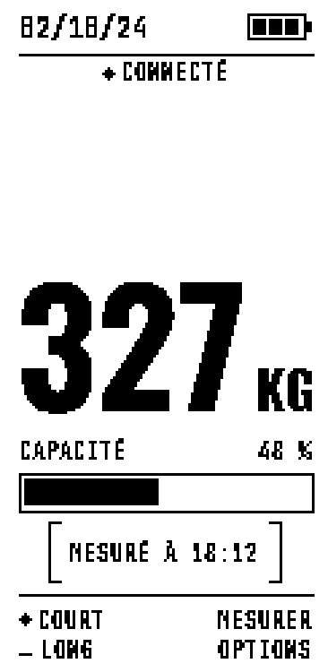
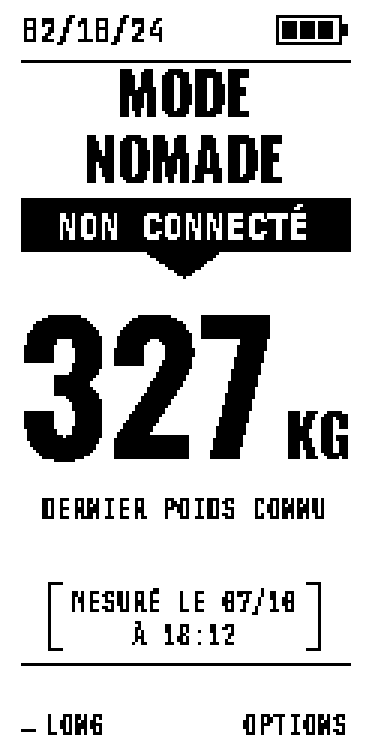
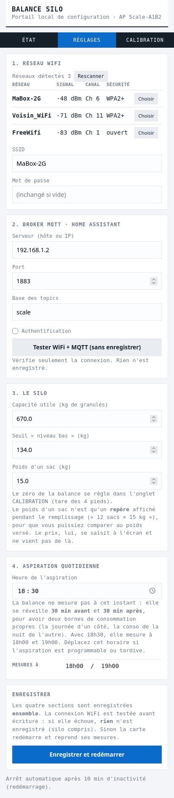

# ESP Scale — balance connectée pour silo à granulés

Une balance sur batterie qui pèse un **silo à granulés** posé sur 4 pieds, affiche
le stock sur un **écran e-paper** et le publie en **MQTT** pour **Home
Assistant** (stock, consommation, coût des remplissages). Elle dort presque tout
le temps : deux mesures par jour, calées sur l'aspiration de la chaudière.

| Écran principal | Hors de sa base (recharge) | Portail de réglages |
|---|---|---|
|  |  |  |

**Version 1.0.1** — documentation en ligne : **<https://baptistev7.github.io/ESPScale/>**

## Ce qu'elle fait

- **Pèse le silo** avec 4 pieds (16 cellules de 50 kg, un HX711 par pied) et
  n'accepte une mesure que si **les 4 pieds répondent**.
- **Mesure 30 min avant et 30 min après l'aspiration** quotidienne (horaire
  réglable) pour séparer la consommation de la nuit des remplissages de la
  journée.
- **Publie en MQTT** seulement ce qui compte : les **baisses** (consommation) et
  les **remplissages** — jamais une dérive de capteur.
- **Guide le remplissage** sur place : nombre de sacs, prix, confirmation par
  appui maintenu ; Home Assistant valorise le stock en €.
- **Se recharge hors de sa base** : on retire le boîtier, on le branche en USB ;
  il le détecte, affiche la charge et revient tout seul à la normale une fois
  reposé.
- **Se règle sans recompiler** depuis un portail web embarqué (WiFi, MQTT,
  silo, calibration).

## Ce qu'il faut

- une carte **LilyGO T5 V2.4** 2.13" (ESP32 + écran e-paper intégré) ;
- **16 cellules de charge 50 kg** et **4 modules HX711** ;
- une **batterie LiPo** 1S, un connecteur **pogo**, deux résistances (1 MΩ et
  10 kΩ) ;
- le boîtier et la base imprimés en 3D (`case/v1/`) ;
- un broker **MQTT** et, idéalement, **Home Assistant**.

Détail : **[docs/MATERIEL.md](docs/MATERIEL.md)**.

## Démarrage

1. **Assembler et câbler** — pieds, base, boîtier, et les trois petites
   modifications de la carte : [MATERIEL.md](docs/MATERIEL.md).
2. **Flasher le firmware** (USB) avec [PlatformIO](https://platformio.org/) :

   ```bash
   ~/.platformio/penv/bin/pio run --target upload
   ```

   Pour une autre carte que celle du projet, mettre son identifiant de port dans
   `platformio.ini` (voir [CONFIGURATION.md](docs/CONFIGURATION.md#compiler-et-flasher)).
3. **Régler WiFi, MQTT et silo** — au premier démarrage, la balance ouvre un
   **portail web** : rejoindre le WiFi `Scale-XXXX` avec le mot de passe affiché
   à l'écran, puis `http://192.168.4.1` : [CONFIGURATION.md](docs/CONFIGURATION.md#le-portail-web).
4. **Calibrer les pieds** — onglet CALIBRATION du portail :
   [CALIBRATION.md](docs/CALIBRATION.md).
5. **Brancher Home Assistant** — packages prêts à l'emploi dans `ha/` :
   [MQTT-HOME-ASSISTANT.md](docs/MQTT-HOME-ASSISTANT.md).

Ensuite, au quotidien : **[le guide utilisateur](docs/GUIDE-UTILISATEUR.md)**.

## Documentation

Toute la documentation est publiée sur **<https://baptistev7.github.io/ESPScale/>**
(sources dans `docs/`).

| Document | Pour qui / pour quoi |
|---|---|
| [GUIDE-UTILISATEUR.md](docs/GUIDE-UTILISATEUR.md) | **Utiliser la balance** : écrans, bouton, remplissage, recharge |
| [MATERIEL.md](docs/MATERIEL.md) | Matériel, câblage, modifications de la carte, boîtier |
| [CONFIGURATION.md](docs/CONFIGURATION.md) | Flasher, portail web, réglages compilés (`config.hpp`) |
| [CALIBRATION.md](docs/CALIBRATION.md) | Calibrer les pieds, limites de la mesure, batterie |
| [MQTT-HOME-ASSISTANT.md](docs/MQTT-HOME-ASSISTANT.md) | Sujets MQTT, règles de publication, intégration Home Assistant |
| [FONCTIONNEMENT.md](docs/FONCTIONNEMENT.md) | Ce que fait le firmware : cycle, bouton, remplissage, mode nomade, écrans |
| [CONSOMMATION.md](docs/CONSOMMATION.md) | Mesures de consommation (PPK2), autonomie estimée, graphiques, diagnostics de veille |
| [DEPANNAGE.md](docs/DEPANNAGE.md) | Problèmes connus et leurs correctifs |
| [SPEC-ecrans.md](docs/SPEC-ecrans.md) | Spécification détaillée des écrans et transitions (développeurs) |
| [CHANGELOG.md](CHANGELOG.md) | Historique des versions |

## État du projet

- ✅ Firmware complet : mesure, publication, remplissage, mode nomade, portail,
  écrans (rafraîchissement partiel quand rien d'important ne change).
- ✅ Consommation mesurée au PPK2 : veille **33 µA** sur la base, **29 µA** hors
  base ; cycle de mesure **0,03 à 0,12 mAh**. Autonomie estimée **10 à 26 mois**
  sur une LiPo de 2000 mAh (autodécharge comprise) :
  [CONSOMMATION.md](docs/CONSOMMATION.md#autonomie).

## Structure du projet

```
ESPScale/
├── src/, include/        # Firmware (PlatformIO, Arduino ESP32)
│   ├── app.cpp           #   cycle de mesure, bouton, remplissage, mode nomade
│   ├── display.cpp       #   tous les écrans e-paper
│   ├── power.cpp         #   sommeil, réveils (ext0/ext1/ULP), batterie
│   ├── sensors.cpp       #   HX711
│   ├── mqtt.cpp, wifi.cpp, time.cpp
│   ├── webconfig.cpp     #   portail web
│   ├── settings.cpp      #   réglages en NVS
│   ├── scheduler.cpp     #   heures de réveil
│   ├── config.hpp        #   réglages compilés
│   └── pins.hpp          #   broches (source de vérité)
├── ha/                   # Packages Home Assistant + dashboard (voir ha/README_install.md)
├── case/v1/              # CAO du boîtier et de la base (PrusaSlicer)
├── docs/                 # Documentation (site GitHub Pages), captures, maquettes UI
├── tools/
│   ├── preview_charte.py # rendu pixel des écrans → docs/screens/
│   ├── portal_preview/   # captures du portail web → docs/screens/
│   ├── render_screens.py # primitives de rendu (fontes de la carte)
│   ├── consommation_graphs.py # graphiques de docs/CONSOMMATION.md
│   └── sleep_floor/      # diagnostic du plancher de veille
├── platformio.ini
├── AGENTS.md             # notes pour les outils de développement
└── CHANGELOG.md
```
