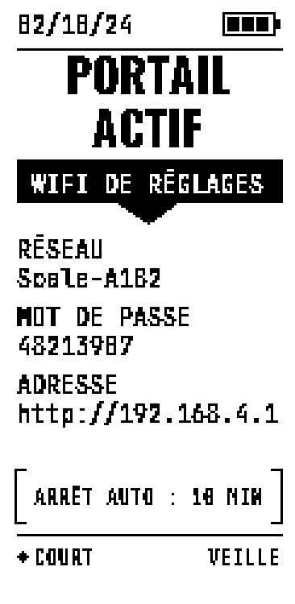
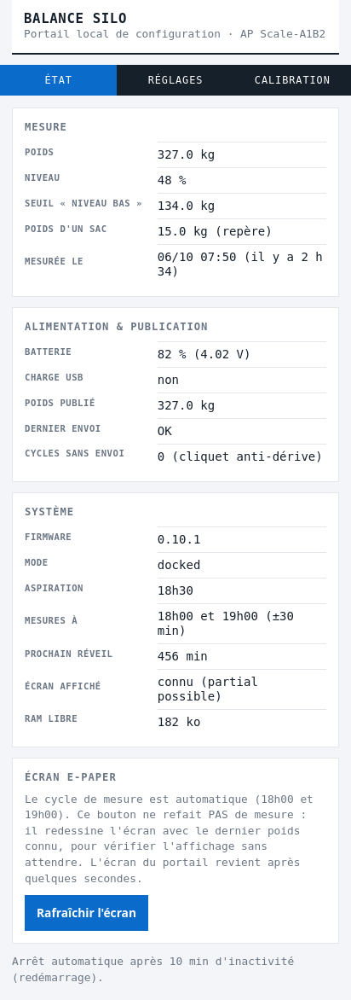
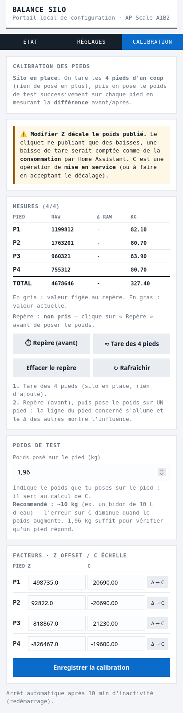

# Configuration

Comment compiler et flasher le firmware, puis tout régler **sans recompiler**
depuis le portail web embarqué. Les réglages « de développeur » restent dans
[`include/config.hpp`](https://github.com/baptistev7/ESPScale/blob/main/include/config.hpp).

## Sommaire

1. [Compiler et flasher](#compiler-et-flasher)
2. [Le portail web](#le-portail-web)
3. [`config.hpp` — réglages compilés](#confighpp--réglages-compilés)

## Compiler et flasher

Prérequis : [PlatformIO](https://platformio.org/) (extension VS Code ou CLI).

```bash
~/.platformio/penv/bin/pio run                    # compiler
~/.platformio/penv/bin/pio run --target upload    # flasher (carte en USB)
~/.platformio/penv/bin/pio device monitor         # logs série (115200 bauds)
```

> Utiliser le `pio` de l'environnement PlatformIO (`~/.platformio/penv/bin/`) :
> celui de certaines distributions est cassé.

**Port série** : [`platformio.ini`](https://github.com/baptistev7/ESPScale/blob/main/platformio.ini) désigne la carte par son
**identifiant stable** (`/dev/serial/by-id/usb-1a86_USB_Single_Serial_…`), pas
par `/dev/ttyACM0` — le numéro change selon l'ordre de branchement (un PPK2 de
mesure, par exemple, prend `ACM0`). **Pour une autre carte**, remplacer cet
identifiant par le sien :

```bash
ls /dev/serial/by-id/
```

Aucun réglage réseau n'est dans le code : une carte fraîchement flashée démarre
dans le portail.

## Le portail web

### Y entrer

- **Carte neuve / sans configuration** : elle démarre **directement dans le
  portail** (elle n'aurait aucun réseau où publier). Si on le ferme sans
  enregistrer, elle **se met en veille** (écran « CARTE EN VEILLE ») ; un appui
  sur le bouton rouvre le portail.
- **Sur demande** : **appui long** sur l'écran principal → menu `OPTIONS` →
  `PORTAIL RÉGLAGES` → **maintenir le bouton 2,5 s** sur l'écran de
  confirmation.

L'écran affiche alors **« PORTAIL ACTIF »** avec tout ce qu'il faut pour s'y
connecter :

| Carte configurée | Carte sans configuration |
|---|---|
|  |  |

1. Rejoindre le WiFi **`Scale-XXXX`** avec le **mot de passe à 8 chiffres**
   affiché (tiré à chaque ouverture : il faut être devant la balance).
2. Ouvrir **`http://192.168.4.1`**.

Le portail **se ferme seul après 10 min** sans activité (`PORTAL_TIMEOUT_MIN`),
ou par un **appui court** (`● COURT REDEMARRER`) : la carte redémarre. Sans
configuration enregistrée, elle se met en veille à la place.

### Les 3 onglets

| ÉTAT | RÉGLAGES | CALIBRATION |
|---|---|---|
|  |  |  |

**1. ÉTAT** — ce que la carte sait maintenant : poids, niveau en %, seuil
« niveau bas », dernière mesure, batterie, dernier envoi MQTT, mode, prochain
réveil, RAM libre. Une valeur inconnue s'affiche `--`. Le bouton **Rafraîchir
l'écran** redessine l'e-paper avec le dernier poids mesuré (ce n'est **pas** une
nouvelle mesure) ; l'écran du portail revient seul après ~8 s.

**2. RÉGLAGES** — un seul formulaire, un seul bouton **« Enregistrer et
redémarrer »** :

- **Réseau WiFi** : liste des réseaux visibles (« Choisir » recopie le SSID),
  ou saisie manuelle pour un réseau masqué. La connexion est **testée avant
  d'écrire** : si elle échoue, rien n'est enregistré.
- **Broker MQTT** : serveur (**hôte seul**, ex. `192.168.1.2`), port, base des
  topics, authentification optionnelle. Le tableau des sujets publiés est
  affiché. **« Tester WiFi + MQTT »** vérifie le réseau et le broker sans rien
  enregistrer.
- **Aspiration quotidienne** : l'heure à laquelle la chaudière aspire. La
  balance mesure **30 min avant et 30 min après** (défaut 18h30 → mesures à
  18h00 et 19h00) pour séparer la conso de la nuit des remplissages de la
  journée.
- **Le silo** : capacité utile, seuil « niveau bas » et poids d'un sac, en kg.

Les mots de passe enregistrés ne sont **jamais** renvoyés dans la page : un
champ laissé vide veut dire « inchangé ». Les actions destructrices demandent
confirmation.

**3. CALIBRATION** — calibration des 4 pieds, voir
[CALIBRATION.md](CALIBRATION.md).

> Les captures sont générées depuis le vrai code du portail :
> `tools/portal_preview/render.sh` compile `src/webconfig.cpp` sur PC et capture
> chaque onglet (à relancer après toute modification du portail).

### Détails techniques

- Tout est stocké en **NVS** (`settings.cpp`) ; la calibration a ses propres
  clés, indépendantes du WiFi.
- Le geste qui ouvre le portail est absorbé avant d'écouter le bouton (sinon le
  relâchement fermerait aussitôt le portail).
- `webConfigRun()` ne rend jamais la main : « sortir » du portail, c'est
  redémarrer — d'où le libellé `REDEMARRER`.

## `config.hpp` — réglages compilés

Ce qui n'est pas dans le portail. Les valeurs à jour font foi dans
[`include/config.hpp`](https://github.com/baptistev7/ESPScale/blob/main/include/config.hpp).

### Réseau et MQTT

```cpp
#define FW_VERSION "…"                    // publié sur <base>/version
constexpr uint16_t MQTT_PORT = 1883;      // défaut du formulaire
#define MQTT_TOPIC_BASE_DEFAULT "scale"   // défaut du formulaire
#define MQTT_SEND_DELTA_KG 1.0f           // publie si baisse >= 1 kg
#define MQTT_BATTERY_DELTA_PCT 5          // ... ou si |Δbatterie| >= 5 %
#define MQTT_HEARTBEAT_CYCLES 8           // ... ou tous les 8 cycles
#define WIFI_CONNECT_TIMEOUT_SEC 15
```

### Matériel

```cpp
#define USE_DOCK_WAKE_DOUT 1    // réveil dédock/redock par DOUT — exige la 1 MΩ
#define USE_CHRG_ULP 1          // réveil de charge par l'ULP en mode nomade
#define USE_EPD_PWR_CUTOFF 1    // coupure écran par GPIO 12 (V2.4)
#define BATTERY_VOLTAGE_RATIO 2.0833f
#define BATTERY_SHUTDOWN_THRESHOLD_V 3.3f
#define BATTERY_EMERGENCY_THRESHOLD_V 3.2f
#define TANK_FULL_KG 670.0
#define BAG_KG 15               // défaut du poids d'un sac
```

`USE_CHRG_ULP` se surcharge à la compilation pour une mesure comparative :
`PLATFORMIO_BUILD_FLAGS="-DUSE_CHRG_ULP=0" pio run`.

### Capteurs

Facteurs d'étalonnage par défaut (`Z_FACTOR_1..4`, `C_FACTOR_1..4`) — remplacés
par ceux du portail dès qu'une calibration est enregistrée. Lecture :
`SENSOR_READ_ATTEMPTS`, `SENSOR_READ_DELAY_MS`, `SENSOR_READY_TIMEOUT_MS`.

### Réveils (`scheduler.hpp`)

| Constante | Rôle |
|---|---|
| `kWakeOffsetMin = 30` | mesures 30 min avant / après l'aspiration |
| `kNomadeDayStartMin = 2` | mode nomade : réveil à 00:02 (nouvelle date) |
| `kNomadeChargePollSec = 300` | mode nomade en charge : réveil toutes les 5 min |
| `kBatteryUsableMah`, `kNomadeSleepCurrentUa` | estimation du « quart de batterie » (réveil de secours) |
