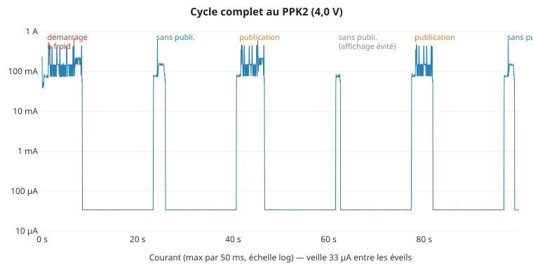
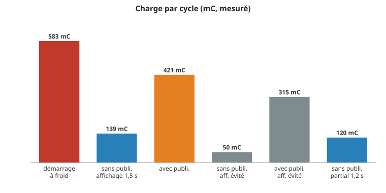
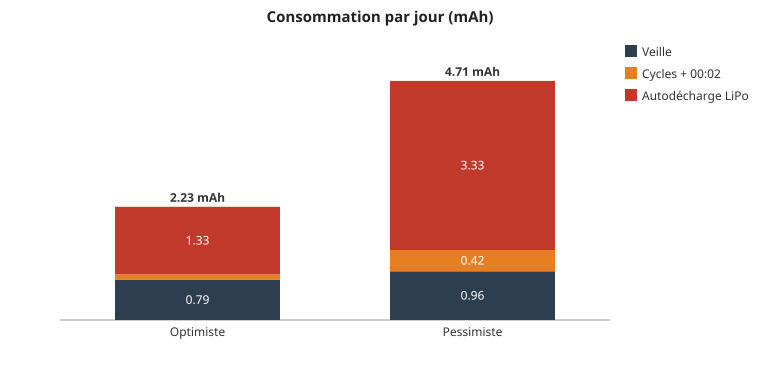
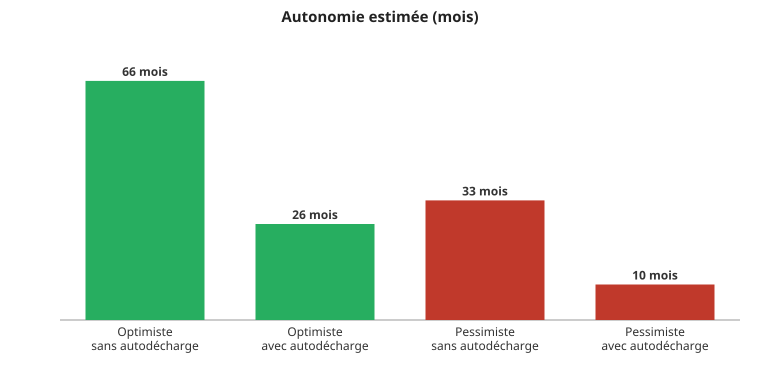

# Consommation — T5 V2.4

Ce document rassemble **les mesures de consommation** de la balance, **la
méthode** pour les refaire, et **ce qu'elles ont appris** sur la carte LilyGO
T5 V2.4. Tout ce qui est écrit « mesuré » l'a été au PPK2 ; tout le reste est
marqué comme estimation ou « à mesurer ».

## Sommaire

1. [En bref](#en-bref)
2. [Banc de mesure](#banc-de-mesure)
3. [Mesures](#mesures)
4. [Ce que la carte consomme en sommeil — et pourquoi](#ce-que-la-carte-consomme-en-sommeil--et-pourquoi)
5. [Mesures sur la base (dock)](#mesures-sur-la-base-dock)
6. [Autonomie](#autonomie)

## En bref

- **Le plancher de la carte est de 27 µA**, pas 192 µA : les 192 µA mesurés
  jusqu'ici venaient de broches laissées dans leur état de démarrage
  (pull-ups internes actives), pas de la carte elle-même.
- **Une broche tenue haute vers le réseau `VCC_IO` coupé coûte des centaines
  de µA** : c'est le cas de **GPIO 14** (SCK du HX711 n°3, aussi CLK du lecteur
  SD avec sa pull-up 10 kΩ) — **+190 à +480 µA** selon le reste de la
  configuration.
- **GPIO 19 tenue basse** : +87 µA (cause non identifiée) ; haute : 0. Elle
  remplace GPIO 14 comme SCK du pied 3.
- **L'ULP, RTC_PERIPH, ext0** : aucun coût mesurable.
- **Firmware corrigé, veille nomade : 29,1 µA** (386 µA avant) — à 2 µA du
  plancher. La SCK du pied 3 passe de GPIO 14 à **GPIO 19** pour que la veille
  **sur la base** en profite aussi (à mesurer).

- **Sur la base (mesuré, 8 oct. 2026)** : veille **33 µA** ; cycle de mesure
  **120 à 140 mC** sans publication, **315 à 420 mC** avec ; démarrage à froid
  500 à 710 mC. Autonomie estimée : **~10 mois (pessimiste) à ~26 mois
  (optimiste)**, dominée par la veille et l'autodécharge de la LiPo.

## Banc de mesure

| Élément | Rôle |
|---|---|
| **Nordic PPK2** en **mode source, 4,0 V** | remplace la batterie (connecteur batterie de la carte) et mesure le courant à 100 kHz |
| **USB de la carte débranché** | sinon c'est l'USB qui alimente la carte, pas le PPK2 |
| Script Python ([`ppk2-api`](https://pypi.org/project/ppk2-api/)) | pilote le PPK2, découpe éveils / sommeil, écrit un CSV moyenné à la ms |

Le script de mesure (`ppk2-api`, boucle d'échantillonnage à 100 kHz, découpe des
éveils au-dessus de 5 mA) n'est **pas conservé dans ce dépôt**. Les phases
détaillées plus bas (capteurs, WiFi + NTP, affichage, MQTT) ont été découpées
avec un **firmware de banc** qui émettait des repères sur GPIO 13, lus par
l'entrée **D0** du PPK2, avec une veille raccourcie à 15 s. Déroulé : flasher le
firmware à mesurer (USB branché), **débrancher l'USB**, puis lancer la mesure
avec démarrage à froid (coupure puis remise sous tension du PPK2).

> Le PPK2 apparaît en `/dev/ttyACM0`/`ACM1` et décale la carte en `ACM2` :
> c'est pourquoi `platformio.ini` désigne la carte par son **identifiant
> stable** (`/dev/serial/by-id/…`), jamais par `ttyACMx`.

## Mesures

Conditions communes : PPK2 4,0 V, USB débranché, boîtier **hors de la base**
(aucun HX711 alimenté), fil CHRG sur GPIO 34 + pull-up 10 kΩ en place,
pull-down 1 MΩ sur le DOUT du pied 1 en place.

### Firmware 0.12.0 (veille nomade)

| Mesure | Résultat |
|---|---|
| Cycle de démarrage → mode nomade (capteurs 2,1 s, WiFi + NTP, WiFi + MQTT, écran complet) | **13,6 s**, 51 mA moyen, pic 617 mA, **694 mC ≈ 0,19 mAh** |
| Veille nomade, **ULP armé** (CHRG + DOUT) | **386,5 µA** |
| Veille nomade, **sans ULP** (ext0 sur DOUT) | **386,5 µA** — l'ULP ne coûte rien |
| **Veille nomade, firmware corrigé** (ULP armé, GPIO 14 relâchée, GPIO 19 sans pull) | **29,1 µA** |
| Cycle démarrage → nomade, firmware corrigé | 14,0 s, 703 mC (inchangé) |

### Sketch minimal (écran coupé, timer seul)

| Mesure | Résultat |
|---|---|
| Réveil (démarrage + mise en sommeil) | 73 ms, 48 mA moyen, 3,5 mC |
| Sommeil | **193 µA** |

Même matériel que ci-dessus : le fil CHRG, la pull-up de GPIO 34 et la
pull-down 1 MΩ ne coûtent rien hors USB. **L'écart 193 → 386 µA vient donc du
firmware.**

### Diagnostic n°1 — quelle broche du firmware coûte ?

Sommeil de 20 s par étape, chaque étape ajoute un réglage de la veille du
firmware au sketch minimal :

| Étape | Ajout | Sommeil |
|---|---|---|
| 0 | minimal | **193 µA** |
| 1 | + **GPIO 14 tenue haute** (SCK n°3) | **463 µA** (+270) |
| 2 | + SCK 32, 27, 21 tenues hautes | 463 µA |
| 3 | + RTC_PERIPH alimenté + ext0 sur DOUT | 463 µA |
| 4 | + pull-downs du balayage (2, 13, 15, 19) | 386 µA |
| 5 | + lignes de l'écran tenues basses (5, 16, 17, 18, 23) | 673 µA |

### Diagnostic n°2 — plancher de la carte

Projet [`tools/sleep_floor/`](https://github.com/baptistev7/ESPScale/tree/main/tools/sleep_floor/) (indépendant du firmware).
Sommeil de 20 s par étape :

| Étape | Configuration | Sommeil |
|---|---|---|
| 0 | minimal : écran coupé (GPIO 12 bas), timer seul | **192,8 µA** |
| 1 | + domaines optionnels forcés OFF (RTC_PERIPH, RTC_FAST_MEM, XTAL, RTC8M, VDD_SDIO) | 192,2 µA |
| 2 | + broches libres¹ reconfigurées en entrée **avec pull-down** | **27,1 µA** |
| 3 | + broches libres¹ reconfigurées en entrée **sans pull** | **27,1 µA** |
| 4 | + **GPIO 19 tenue basse** | 114 µA (+87) |
| 5 | + UART (1, 3) en entrée sans pull | 114 µA |
| 6 | + isolation des GPIO par l'IDF | 114 µA |

¹ 2, 4, 5, 13, 14, 15, 16, 17, 18, 21, 22, 23, 25, 26, 27, 32, 33 — ni 0 (BOOT),
ni 12 (coupure écran), ni 34-39 (entrées seules).

## Mesures sur la base (dock)

Conditions : PPK2 4,0 V, USB débranché, boîtier **posé sur la base** (4 HX711
alimentés puis en power-down), WiFi + broker joignables, firmware 0.12.1 (avant le partial de l'écran principal) +
repères de banc. Tous ces chiffres sont **mesurés** sauf mention.

### Veille

| Mesure | Résultat |
|---|---|
| Veille sur la base (3 runs de 60 s + 1 de 100 s) | **32,9 à 33,2 µA** |

L'estimation précédente était 31 µA + modules : les 4 HX711 en power-down
coûtent ~2 µA au total (écart de deux chiffres, non mesuré séparément).

### Démarrage à froid (heure invalide : NTP complet, affichage complet, MQTT)

3 runs, puis 1 run du second banc :

| Phase | Durée | Courant moyen | Charge |
|---|---|---|---|
| Capteurs | 0,71 s | 54,9 mA | 38,7 mC |
| WiFi + NTP | 3,5 à 7,6 s | 70 à 76 mA | 262 à 535 mC |
| Affichage complet | 1,52 s | 64 à 70 mA | 98 à 106 mC |
| MQTT | 0,06 à 0,08 s | 130 mA | 8 à 10 mC |
| Fin de cycle | 0,12 s | 39 mA | 4,5 mC |
| **Cycle complet** | 7,1 à 10,5 s | 67 à 70 mA | **499 / 523 / 583 / 707 mC** |

Le WiFi + NTP pèse 65 à 75 % de la charge et sa durée varie du simple au
double d'un essai à l'autre : c'est la source de dispersion.

### Réveils timer (heure valide, cycle planifié)

Réveils toutes les 15 s sur le banc, un cycle sur deux avec publication :

| Cycle | Durée | Charge | Détail |
|---|---|---|---|
| Sans publication, affichage partiel | 2,16 s | **120 mC** | affichage 1,22 s / 71 mC |
| Sans publication, affichage 1,5 s | 2,46 s | **139 mC** | affichage 1,52 s / 89 mC |
| Sans publication, **affichage évité** (même minute) | 0,96 s | **50 mC** | cas du banc seulement, voir ci-dessous |
| Avec publication, affichage partiel | 5,89 s | **421 mC** | WiFi + NTP 3,65 s / 279 mC ; affichage 1,22 s / 82 mC |
| Avec publication, affichage évité | 4,47 s | **315 mC** | WiFi + NTP 3,55 s / 261 mC |

- Le partial coûte 1,2 s et 70 à 82 mC contre 1,5 s et ~100 mC en complet :
  **~20 à 25 mC gagnés par cycle**, soit moins de 0,01 mAh/jour.
- « Affichage évité » n'arrive sur le banc que parce que deux cycles tombent dans
  la même minute. En usage réel (cycles espacés de ~12 h), l'heure de mesure
  change toujours : il y aura **toujours au moins un partial**.
- Le réveil de 00:02 en dock (partial de la date seule) est **validé sur la
  carte** (minuit simulé, partial de l'en-tête) mais sa **consommation n'est pas
  mesurée**. Estimation : ~80 à 100 mC (démarrage + partial, sans capteurs ni
  réseau).
- Non déterminé : l'affichage de 1,52 s du second cycle était-il un partial avec
  réécriture de l'ancienne image, ou un complet.

## Autonomie

Mode **sur la base** uniquement (2 réveils de mesure par jour, plus le réveil de
00:02 pour la date). Le nomade (29 µA, poll de charge) n'est pas compté. Les
boutons (mesure à la demande, menu, remplissage) ne le sont pas non plus.

### Hypothèses

| | Optimiste | Pessimiste | Origine |
|---|---|---|---|
| Veille | 33 µA | 40 µA (marge) | mesuré / marge |
| Cycle sans publication | 120 mC | 139 mC | mesuré |
| Cycle avec publication | 385 mC | 707 mC | 315 + partial 71 (calculé) / pire mesuré |
| Publications par jour | 0,25 (heartbeat tous les 4 jours) | 2 (chaque cycle, conso ≥ 1 kg) | hypothèse d'usage |
| Réveil de 00:02 | 80 mC | 100 mC | estimé, non mesuré |
| Capacité nominale | 2000 mAh | 2000 mAh | `MATERIEL.md` |
| Capacité utilisable | 90 % (1800 mAh) | 70 % (1400 mAh) | hypothèse : coupure à 3,3 V, vieillissement |
| Autodécharge LiPo | 2 %/mois (1,33 mAh/jour) | 5 %/mois (3,33 mAh/jour) | **valeurs génériques, non mesurées** |

### Consommation par jour

| | Optimiste | Pessimiste |
|---|---|---|
| Veille | 0,79 mAh | 0,96 mAh |
| Cycles de mesure + réveil de 00:02 | 0,11 mAh (386 mC) | 0,42 mAh (1 514 mC) |
| **Total (hors autodécharge)** | **0,90 mAh/jour** | **1,38 mAh/jour** |
| Autodécharge | 1,33 mAh/jour | 3,33 mAh/jour |
| **Total avec autodécharge** | **2,23 mAh/jour** | **4,71 mAh/jour** |

### Autonomie

| | Optimiste | Pessimiste |
|---|---|---|
| Sans autodécharge | 2 000 jours (~5,5 ans) | 1 014 jours (~2,8 ans) |
| **Avec autodécharge** | **~806 jours (~26 mois)** | **~297 jours (~10 mois)** |

- **La veille domine** (60 à 70 % de la consommation de la carte) et
  l'**autodécharge de la batterie est supérieure à tout le reste**. Les
  économies de cycle (partial d'affichage : <0,01 mAh/jour) ne changent presque
  rien à l'autonomie.
- Le levier qui compte : la **veille** (33 µA = 0,79 mAh/jour), puis le nombre de
  publications avec WiFi (2 à 5 fois le coût d'un cycle sans publication).
- Le chiffre pessimiste dépend surtout de deux hypothèses **non mesurées** :
  l'autodécharge et la capacité utilisable. Les deux se mesurent avec une batterie
  réelle laissée au repos.

## Ce que la carte consomme en sommeil — et pourquoi

### Le réseau `VCC_IO`

Sur la T5 V2.4, le régulateur **U6** (rail `VCC_IO`) est coupé par **GPIO 12**
pour éteindre l'écran. D'après le schéma (V2.3, partie alimentation identique
hors GPIO 12), ce rail alimente aussi :

- l'**écran** e-paper ;
- les **pull-ups 10 kΩ du lecteur micro-SD**, sur GPIO **2, 13, 14, 15**.

Rail coupé, ces résistances deviennent des **pull-downs 10 kΩ vers un rail à
0 V**. Deux conséquences mesurées :

- **une broche tenue HAUTE** sur ce réseau réalimente le rail à travers la
  10 kΩ, et le rail à demi alimenté débite à son tour dans tout ce qui y est
  relié : **GPIO 14 haute = +190 à +480 µA** ;
- **une pull-up interne active** sur ces broches (état de démarrage de
  certaines pads) débite de la même façon — c'est l'essentiel des
  **193 → 27 µA** gagnés en reconfigurant les broches libres. *Les broches
  précises n'ont pas été isolées une à une.*

C'est aussi pourquoi **CHRG ne fonctionne pas sur GPIO 13 ou 15** (ligne lue
basse en permanence) et a été placé sur **GPIO 34** avec une pull-up externe
vers **+3V3** (le 3,3 V de l'ESP, pas `VCC_IO`).

### GPIO 19

Diagnostic n°3, au plancher (broches libres sans pull), GPIO 19 seule modifiée :

| GPIO 19 en sommeil | Sommeil |
|---|---|
| non touchée | 27,6 µA |
| **tenue haute** | **27,6 µA** |
| tenue basse | 114,7 µA (+87) |
| pull-down | 27,6 µA |
| pull-up | 27,6 µA |

Seul l'état bas coûte (cause non identifiée : aucune LED visible sur la carte).
Une SCK de HX711 est haute pendant tout le sommeil : GPIO 19 accueille donc la
SCK du pied 3 à la place de GPIO 14.

### Ce qui ne coûte rien (mesuré)

- le coprocesseur **ULP** (lit CHRG + DOUT toutes les ~400 ms) ;
- **RTC_PERIPH** maintenu (ext0 ou ULP) ;
- les domaines optionnels (`esp_sleep_pd_config`) ;
- les SCK **32, 27, 21** tenues hautes (hors base) ;
- le fil **CHRG** + pull-up 10 kΩ sur GPIO 34, et la pull-down **1 MΩ** du
  DOUT (hors USB, boîtier hors base).

## Estimation sur la base

Veille **sur la base** (état le plus courant), à partir des mesures ci-dessus :

| Poste | Valeur | Source |
|---|---|---|
| Carte, broches bien configurées | 27 µA | mesuré |
| Pull-down 1 MΩ, DOUT haute (boîtier posé) | 3,3 µA | calculé |
| ext0 / RTC_PERIPH | ~0 | mesuré |
| 4 HX711 en power-down | < 1 µA chacun (fiche technique) ; **modules non mesurés** | à mesurer |
| SCK du pied 3 tenue haute, **sur GPIO 19** | 0 (sur GPIO 14 : +190 à +480 µA) | mesuré |

**Estimation : ~31 µA + modules HX711** — **mesuré ensuite : 33 µA** (voir
[Mesures sur la base](#mesures-sur-la-base-dock)).

## Historique

### T5 V2.3.1 (mesures périmées)

Conservées pour comparaison ; **ne s'appliquent plus** à la carte actuelle.

| Phase (V2.3.1) | Durée | Courant moyen | Charge |
|---|---|---|---|
| Capteurs (init + lecture 4×HX711) | 1,152 s | 59,2 mA | 68,2 mC |
| Affichage (un rendu e-paper) † | ~1,40 s | ~52 mA | ~73 mC |
| WiFi/MQTT (connexion + NTP + publication) † | 1,732 s | ~94 mA | 163,2 mC |
| Cycle sans changement | 2,549 s | 55,4 mA | 141,2 mC |
| Cycle complet | 4,281 s | 71,1 mA | 304,5 mC |
| Deep sleep (base branchée) | 5,196 s | 231,4 µA | 1,20 mC |

† Déduits des deux cycles. Autonomie V2.3.1 calculée : ~5,7 mAh/jour, ~10 mois.

### Notes

- **T5 V2.3.1** (carte précédente) : mesures périmées pour la V2.4.
- **V2.4, avant ce document** : « 192 µA, plancher de la carte » — **faux** :
  c'était le plancher d'un firmware qui laissait les broches dans leur état de
  démarrage.
