# Fonctionnement

Comment le firmware vit au quotidien : quand il se réveille, ce qu'il mesure et
publie, comment il réagit au bouton, au remplissage et au retrait du boîtier.

> 👤 Pour l'**usage** (gestes, écrans, cas courants) :
> [GUIDE-UTILISATEUR.md](GUIDE-UTILISATEUR.md). Pour la **spécification
> complète** des écrans et transitions : [SPEC-ecrans.md](SPEC-ecrans.md).

## Sommaire

1. [Le cycle de mesure](#le-cycle-de-mesure)
2. [Le bouton](#le-bouton)
3. [Le remplissage](#le-remplissage)
4. [Mode nomade (hors de la base)](#mode-nomade-hors-de-la-base)
5. [Les écrans](#les-écrans)
6. [Économies d'énergie](#économies-dénergie)

## Le cycle de mesure

La balance dort et se réveille **deux fois par jour, 30 min avant et 30 min
après l'aspiration** de la chaudière (horaire réglé dans le portail, défaut
18h30 → 18h00 et 19h00) :

- la mesure **d'après** capture le niveau juste après l'aspiration → conso de la
  nuit ;
- la mesure **d'avant** sépare les remplissages de la journée de cette conso.

```
Réveil → capteurs (attente concurrente, 2 s max) → poids 4/4
→ batterie + état de charge
→ quelque chose à publier ? (voir le cliquet)
   → oui : WiFi → synchro NTP → écran (heure corrigée) → MQTT → WiFi off
   → non : écran (heure RTC)
→ capteurs en veille → deep sleep jusqu'au prochain créneau
```

- La synchro NTP passe **avant** l'écran, qui affiche la date : sinon il
  montrerait l'heure de l'horloge interne, qui dérive de plusieurs minutes par
  jour. Le MQTT passe **après** l'écran.
- **Strict 4/4** : un seul pied muet et la mesure est ignorée. 1-3 pieds →
  mode **dégradé** (écran « CAPTEUR(S) HS », dernier poids stable) ; 0 pied →
  boîtier hors de sa base, **mode nomade**.
- Ce qui est publié et quand : [MQTT-HOME-ASSISTANT.md](MQTT-HOME-ASSISTANT.md#le-cliquet-de-publication).

## Le bouton

Un seul bouton (GPIO 39). Le **pied de chaque écran annonce exactement** les
gestes acceptés : `● COURT` (< 1 s) à gauche, `— LONG` (≥ 1 s) en dessous, et
l'action alignée à droite.

| Où | `● COURT` | `— LONG` |
|---|---|---|
| Écran principal (sur la base) | mesure à la demande, puis sommeil | menu `OPTIONS` |
| Menu `OPTIONS` | ligne suivante | valider la ligne |
| Écran nomade (hors base) | relit la charge (non annoncé) | menu `OPTIONS` |

Menu `OPTIONS` :

- `REMPLISSAGE` → le parcours de remplissage (inactif hors base : impossible de
  verser sans le silo sur sa balance) ;
- `PORTAIL RÉGLAGES` → confirmation (maintien 2,5 s) puis portail ;
- `INFORMATIONS` → 2 pages (état général / poids par pied), `● COURT` bascule
  de l'une à l'autre, `— LONG` revient au menu ;
- `FERMER` → écran principal avec le **dernier poids connu**, sans nouvelle
  mesure, puis sommeil.

Détails techniques :

- GPIO 39 est une **entrée seule** : la pull-up est celle de la carte (repos = 1,
  appui = 0). Réveil : `ext1` sur niveau bas.
- Sur cette IDF, `esp_sleep_get_ext1_wakeup_status()` peut renvoyer 0 après un
  vrai réveil : la source est déterminée par l'**état réel** de la broche.
- L'appui qui réveille la carte n'est pas compté comme un geste.
- Pendant les sessions interactives, une **ISR de timer à 1 kHz** capte les
  appuis, même pendant un rafraîchissement bloquant : aucun appui n'est perdu.

## Le remplissage

Se lance **sur la balance** (`OPTIONS` → `REMPLISSAGE`), carte éveillée tout du
long :

```
OPTIONS ─ REMPLISSAGE ─▶ mesure « avant » ─▶ 1/3 EN COURS (poids versé en direct)
                                              │ ● court
                                              ▼
                                         2/3 NOMBRE DE SACS (● +1, — valider)
                                              ▼
                                         3/3 PRIX PAR SAC (par chiffres)
                                              │ — sur le dernier chiffre : mesure « après »
                                              ▼
                       ┌────────────▶ « TERMINER ? » (récap) ── maintien 2,5 s ──▶ « ENREGISTRÉ » (1 min) ─▶ écran principal
                       │                     │ ● court
                       └─(re-mesure)── « CORRIGER ? » : sacs / prix / ANNULER / RETOUR
```

1. **Mesure « avant »** automatique (après contrôle batterie ≥ 3,3 V), état
   `pouring` publié.
2. **1/3 EN COURS** : le poids versé se lit en direct (lecture toutes les 3 s,
   rafraîchi au-delà de 0,5 kg).
3. **2/3 NOMBRE DE SACS** : `● COURT` = +1 sac, `— LONG` = valider.
4. **3/3 PRIX PAR SAC** : `x,xx €` saisi chiffre par chiffre (défaut 4,05 €) ;
   `● COURT` = +1, `— LONG` = chiffre suivant, `VALIDER` sur le dernier → mesure
   « après ».
5. **« TERMINER ? »** : poids réellement ajouté, sacs, coût. **Maintenir 2,5 s**
   publie (`value`, `refill/state = saved`, `refill/event`). Lâcher pendant le
   maintien ne fait rien ; un appui court ouvre **« CORRIGER ? »** sans rien
   publier.
6. **« ENREGISTRÉ »** : récap affiché 1 minute, puis écran principal sans
   nouvelle mesure.

**Abandon** (10 min sans geste, poids qui baisse pendant le versement, `ANNULER`)
: le parcours **ne publie rien** — aucun prix non confirmé ne part — et enchaîne
un cycle de mesure normal ; s'il y a eu versement, il est publié en
**remplissage sauvage**.

**Garde-fous** :

- Le parcours ne dort jamais : un réveil qui trouve encore ce mode (reset en plein
  parcours) le traite en abandon.
- **Boîtier retiré pendant un remplissage** : mis en attente
  (`refill_pending`) et **repris au retour sur la base**, au bon endroit (avant
  ou après la mesure « avant » ; sacs et prix conservés). Au-delà d'**1 h**,
  annulé.
- Capteurs en panne (1-3/4) pendant un remplissage → annulation.

## Mode nomade (hors de la base)

Retirer le boîtier de sa base (pour le recharger, par exemple) coupe les 4 HX711.
La carte le détecte et passe en **mode nomade** :

| Événement | Ce que fait la carte |
|---|---|
| **Retrait du boîtier** | réveil **immédiat** (la ligne DOUT du pied 1 tombe à 0 grâce à la 1 MΩ), mesure 0/4 confirmée, écran « MODE NOMADE » (dernier poids connu + date de la mesure), `error/on-off = on` publié — seule connexion WiFi du mode nomade |
| **Hors charge** | dort jusqu'à **00:02** (nouvelle date à l'écran, capteurs re-testés, garde batterie, NTP si > 24 h) |
| **USB branché / charge finie** | réveil **immédiat** par le coprocesseur ULP (CHRG change), l'éclair apparaît / disparaît |
| **En charge** | réveil toutes les **5 min**, sans WiFi : seule l'icône batterie est rafraîchie si ses segments changent |
| **Retour sur la base** | réveil **immédiat** (DOUT repasse à 1), mesure 4/4, fin d'erreur publiée, retour au cycle normal |

**Comment la carte surveille tout ça en dormant** :

- **Sur la base** : `ext0` surveille la ligne DOUT du pied 1 (passage à 0 =
  retrait), `ext1` le bouton.
- **Hors base** : le **coprocesseur ULP** lit toutes les ~400 ms la ligne DOUT
  (passage à 1 = retour) et **CHRG** (changement confirmé sur 5 lectures), à la
  place d'`ext0` — l'IDF refuse de combiner les deux. L'ULP est arrêté dès que la
  carte se réveille et ne tourne qu'en mode nomade. **Coût mesuré : nul.**
- Un timer reste toujours armé, en secours.
- Le niveau de la ligne ne fait que réveiller : c'est la **mesure** qui
  confirme l'état (0/4 → nomade, 4/4 → sur la base).

Le principe de la ligne DOUT (HX711 en veille = DOUT à 1, boîtier retiré =
ligne ramenée à 0 par la 1 MΩ) est détaillé dans
[MATERIEL.md](MATERIEL.md#2-réveil-au-dédock--redock--1-mω-sur-le-dout-du-pied-1).

> « 0 capteur » est toujours interprété comme « hors base » : une panne des 4
> pieds à la fois s'afficherait aussi en mode nomade.

## Les écrans

Tous les écrans sont dessinés dans `src/display.cpp`, en polices bitmap dédiées
(`include/fonts/`, accents compris), sur une grille commune : en-tête (date,
éclair de charge, batterie 3 segments), contenu, pied annonçant les gestes.

| Principal | Niveau bas | En charge | Capteur(s) HS |
|---|---|---|---|
|  | 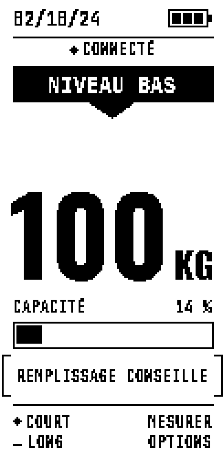 | 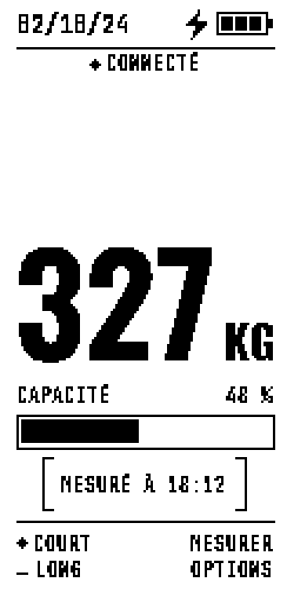 | 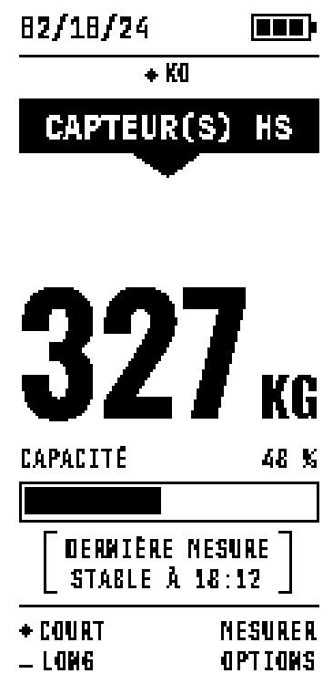 |

| Nomade | Nomade sans mesure | Menu OPTIONS | Menu hors base |
|---|---|---|---|
|  | 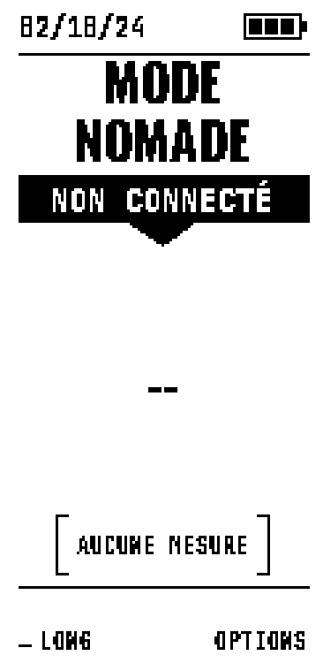 | 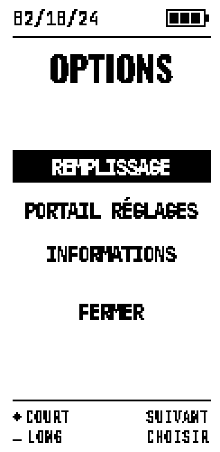 | 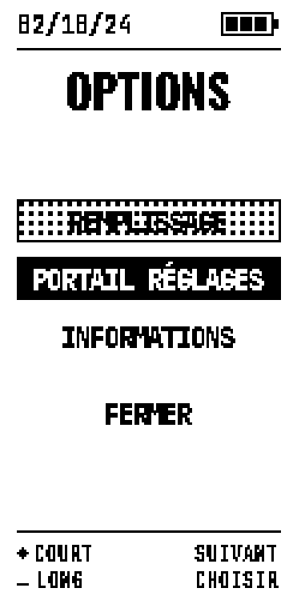 |

| Informations 1/2 | Informations 2/2 | Confirmation portail | Portail actif | Carte en veille |
|---|---|---|---|---|
| 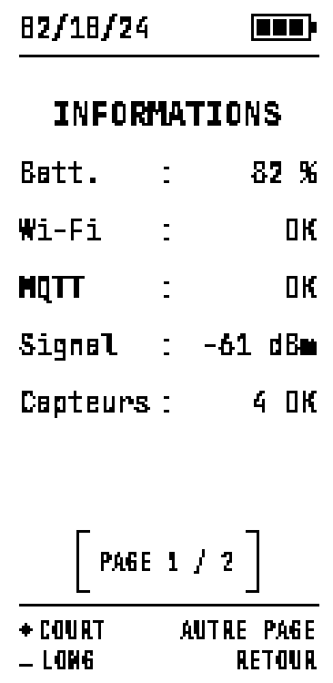 | 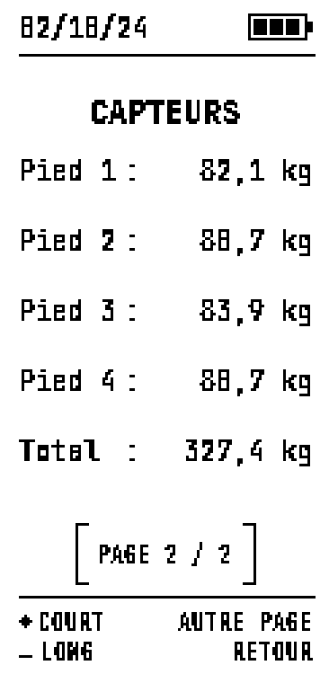 | 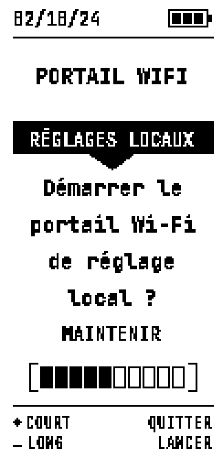 | 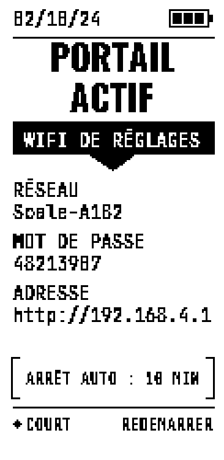 | 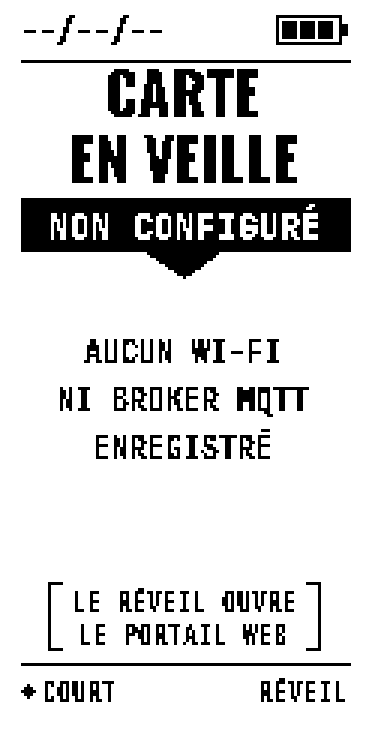 |

| Remplissage 1/3 | 2/3 | 3/3 | Terminer ? | Corriger ? | Enregistré |
|---|---|---|---|---|---|
| 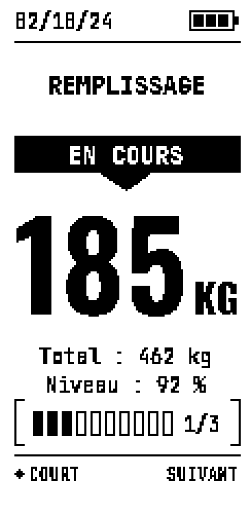 | 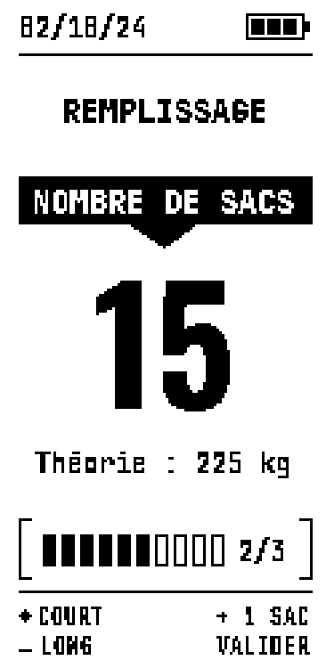 | 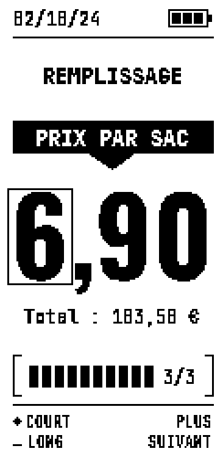 | 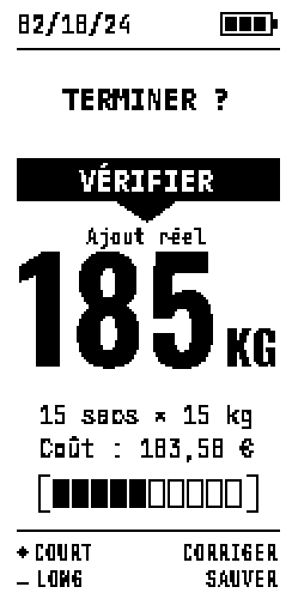 | 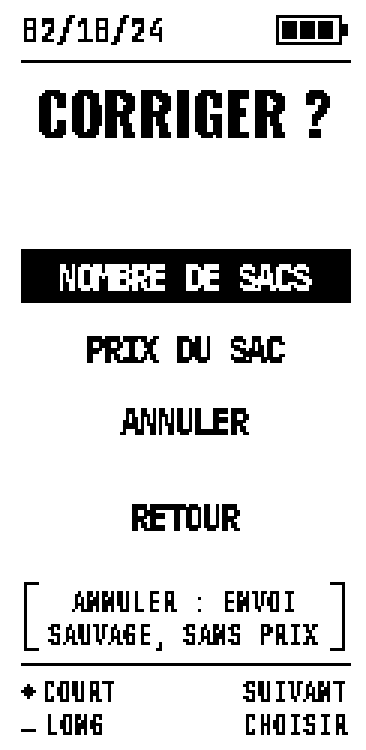 | 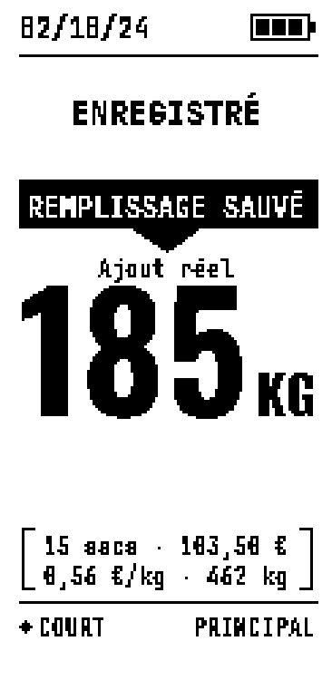 |

Ces images sont le **rendu pixel** de ce qui part sur la dalle (122 × 250,
agrandi ×3), généré par `tools/preview_charte.py --docs`, qui rejoue la géométrie
de `display.cpp` (à relancer après toute modification). Les maquettes de design
sont dans `docs/UI/ECRANnn/`.

### Rafraîchissement complet ou partiel

Le partiel prend **~856 ms sans flash**, contre **~1,36 s avec flash** pour le
complet. **Tout est en complet par défaut** (contraste garanti) ; le partiel ne
sert qu'au **retour visuel**, là où une petite zone change :

- **Remplissage** : à chaque geste (poids versé, sacs, chiffre du prix, barre de
  maintien), avec un complet au changement de chiffre et tous les 10 sacs
  (le partiel laisse du gris à la longue).
- **Mode nomade** : seule l'icône batterie / éclair. L'alimentation de l'écran
  étant coupée pendant le sommeil, sa mémoire d'image est perdue : au réveil,
  l'écran nomade est **redessiné à l'identique** en mémoire (même heure que son
  dernier complet), puis seule l'icône change en partiel.

## Économies d'énergie

1. **Deep sleep** entre les mesures, réveils au plus juste (créneaux, ou 00:02
   en mode nomade).
2. **WiFi** seulement s'il y a quelque chose à publier ; timeout court, coupé
   aussitôt après.
3. **Écran** : alimentation coupée pendant le sommeil (GPIO 12), lignes tenues
   basses.
4. **HX711** en veille pendant le sommeil (SCK tenue haute).
5. **Broches** inutilisées configurées pour le sommeil (sinon des pull-ups
   internes débitent dans le réseau `VCC_IO` coupé).
6. **Pas de réveil périodique hors charge** en mode nomade.

Mesures et méthode : [CONSOMMATION.md](CONSOMMATION.md).
